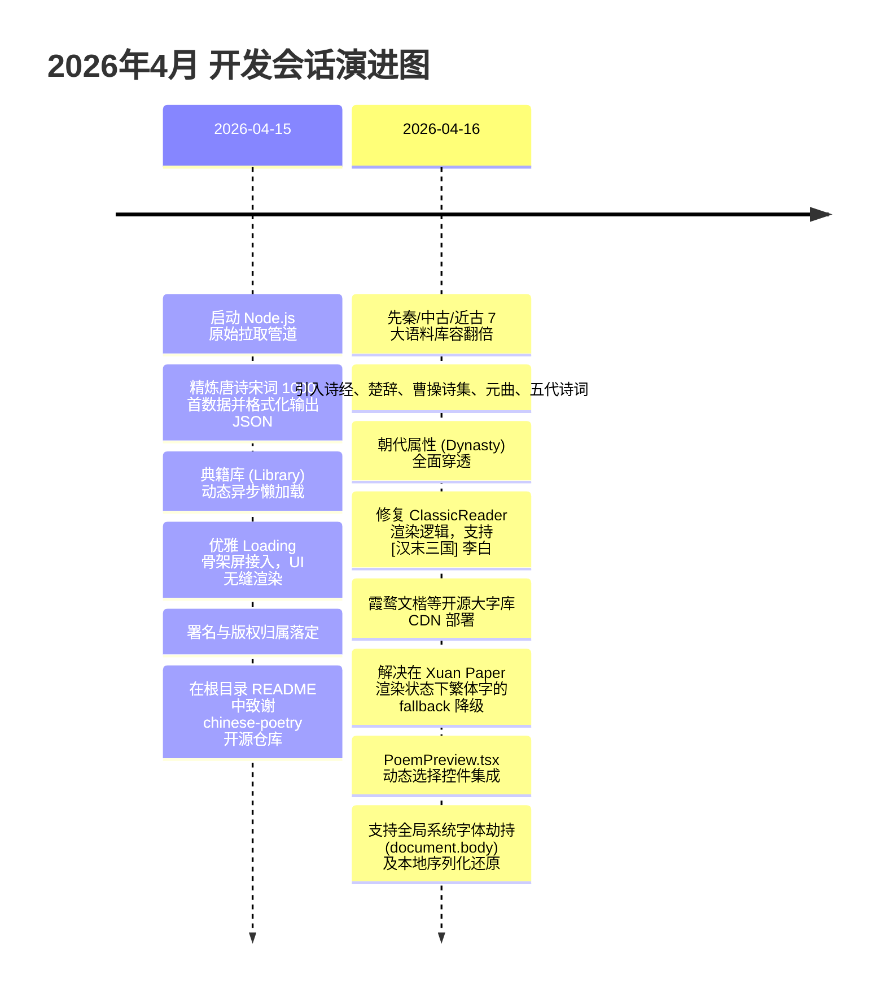

# 偶成 (Ou Cheng) — 诗词语料大集成与动态字体字库重构大编年史
> **文档类别**: 项目历史与编年史档案 (`HIST_RECORD`)  
> **版本号**: 语料大融合与抗生僻字字库版 (V4.2.0)  
> **重大事件发生区间**: 2026-04-15 — 2026-04-16  
> **基于规范**: [SPEC_20260520_GLOBAL_DEVELOPMENT_STANDARDS.md](file:///Users/quantumrose/Documents/Emberois/SPEC_20260520_GLOBAL_DEVELOPMENT_STANDARDS.md)

---

## 🧭 一、 里程碑概述

本历史档案详尽记录了在 **2026年4月15日** 至 **2026年4月16日** 期间，偶成 (Ou Cheng) 本地古诗词系统经历的两次核心突破与功能演进：
1. **百万字级经典离线语料大融合**：成功实现从开源项目 `chinese-poetry/chinese-poetry` 本地化拉取整合唐诗、宋词、诗经、楚辞、曹操诗集、元曲及五代十国诗词等 7 大古典文学支脉，整合了近 **2,000** 篇优秀作品，完成了朝代属性在数据层和 UI 层的完美适配。
2. **生僻字抗fallback与多层级动态字体系统**：通过全面引入高保真、大字库的开源书法字体 **霞鹜文楷 Lite (LXGW WenKai)** 及其它 4 款优雅字体，攻克了古诗词生僻汉字无法在浏览器端协调渲染的顽疾，并首创了「作品级套用」和「一键设为全局系统字体」的双层级自定义皮肤功能。

---

## 📅 二、 编年史大事件记录 (History Timeline)



---

## 🛠️ 三、 核心重构板块深度审计

### 1. 离线清洗脚本 [fetch-poetry.js](file:///Users/quantumrose/Documents/Emberois/ou-cheng/scripts/fetch-poetry.js)
在此次重构之前，偶成的典籍模块完全依靠 Mock。在 **4月15日** 会话中，我们开发了专门的抓取与清洗工具：
*   **原生异步请求流**：借助 Node.js 原生的 `https` 发起 RAW GitHub GET 请求。由于国内拉取 GitHub 资源极易超时，故在数据处理端设计了严密的 `try-catch` 容错和网络抖动重试机制。
*   **格式自适应适配器**：
    *   *诗经解析*：由于诗经无明确作者（佚名），且有“风雅颂”之分的国风章节，故在 [fetch-poetry.js:L8](file:///Users/quantumrose/Documents/Emberois/ou-cheng/scripts/fetch-poetry.js#L8) 将其标题和章节进行了二次格式化：`title: "${item.chapter}·${item.title}"`。
    *   *曹操诗集*：将爬取段落拼接为 `content` 并将作者强制改写为 `曹操`，确保数据纯净。

### 2. 生僻字及动态字体管线设计
在 **4月16日** 的会话中，为彻底攻克生僻字方块的渲染局限，团队对全局渲染管线进行了重大变革：
*   **高速 Loli Fonts 镜像引入**：
    因中文字体通常都在 3M-15M 左右，直接加载会有长达数秒的“白屏闪动”或“隐形文本 (FOIT)”，我们在 [index.html:L12-L15](file:///Users/quantumrose/Documents/Emberois/ou-cheng/index.html#L12-L15) 引入了对国内最快、最稳定的 Google Fonts 国内公益镜像 `fonts.loli.net` 及 `jsdelivr` 极速 CDN 的 preconnect 预解析链接。霞鹜文楷采用 Lite 压缩版，大幅削减了不常用的异体字数据流，将体积压缩到极致，兼顾了字库完整度与加载速度。
*   **全局样式劫持逻辑**：
    在 [index.tsx:L13-L16](file:///Users/quantumrose/Documents/Emberois/ou-cheng/index.tsx#L13-L16) 中，设计了生命周期拦截器：
    ```typescript
    const settings = getSettings();
    if (settings.globalFont && settings.globalFont !== 'none') {
      document.body.style.fontFamily = FONT_STYLES[settings.globalFont]?.family || '"Ma Shan Zheng", serif';
    }
    ```
    当用户更改了偏好后，将立刻更新 LocalStorage，并安全、快速地重写整个 DOM 根节点，以纯 CSS 变量流的方式优雅渗透到整套 UI 组件中。

---

## ⚖️ 四、 版本合并与冲突规避备忘

> [!WARNING]
> 1. **大文件网络抓取冲突**：
>    在不同的网络和设备环境下执行 `npm run fetch-data` 时，可能会遇到 GitHub 连接阻断或证书失效的问题。在开发规范中，我们将生成的 `poetry.json` 一同归档加入 Git，这使得一般用户在运行 `npm run dev` 时**完全不需要重新拉取**，立即可用。
> 2. **历史古诗数据向后兼容性**：
>    由于 `types.ts` 新引入了 `fontStyle?: FontStyle;` 属性，请务必保证在遍历/反序列化历史旧诗词时具有良好的兼容兜底行为。目前，预览控件 `PoemPreview` 的内层样式以及主列表中的渲染函数均已加上了 `poem.fontStyle || 'none'` 的兜底解析保护，避免了运行时产生的 `undefined` 崩溃风险。

---

## 🏁 五、 历史资产评价

2026年4月中旬的这两次会话，是偶成 (Ou Cheng) 产品路线图上的重要技术基石。它不仅成功消除了长久以来限制古典诗文软件品味的“字库瑕疵与空洞数据”两个根本性障碍，更为偶成后续的「挥毫」（即 V4.0 大模型自适应对仗排版、智能辅助创作、交互心流重构）提供了坚实无比的数据骨架和叹为观止的高端美学外包，堪称极简国风古籍软件界的一座重要技术丰碑！
