# 偶成 (Ou Cheng) — 东方美学视觉重构与字体渲染管线深度修复大编年史

> **文档类别**: 项目历史与编年史档案 (`HIST_RECORD`)  
> **版本号**: 词汇古典化、扁平插画级图标集成与字体全局自适应版 (V4.3.0)  
> **重大事件发生区间**: 2026-04-16  
> **基于规范**: [SPEC_20260520_GLOBAL_DEVELOPMENT_STANDARDS.md](file:///Users/quantumrose/Documents/Emberois/SPEC_20260520_GLOBAL_DEVELOPMENT_STANDARDS.md)

---

## 🧭 一、 里程碑概述

在 **2026年4月16日** 期间，本协同大模型（Antigravity）与人类开发者并肩作战，针对“偶成 (Ou Cheng)”应用的核心视觉传达、国风概念交互以及中文字体加载稳定性，开展了两次里程碑式的深度重构：

1.  **词汇古典化演进与东方插画级图标系统集成**：彻底摒弃了大白话文案与违和的现代 Emoji 导航。根据朱砂红点缀的东方极简线稿风（Flat Vector UI）预设 Prompt，由 AI 生成四枚高品质视觉图标并全面替换侧边栏，将产品交互界面提升到极致优雅的古典意境中。
2.  **字体加载与全局切换管线深度修复**：彻底攻克了“修改字体后显示效果不变”的致命瑕疵。将字体源迁回至高速稳定的国内镜像源 `fonts.loli.net`，在 [index.css](file:///Users/quantumrose/Documents/Emberois/ou-cheng/index.css) 中提炼出三大 CSS 字体变量栈，并采用外科手术式手段全面清理了整套项目代码中散落的所有硬编码 `fontFamily` 行内样式，确立了以 CSS 变量进行全局自适应劫持的架构，让“印匣（设置）”中的字体切换顺畅无阻。

---

## 📅 二、 编年史大事件记录与真实时间线 (Dialogue Timeline)

本记录已深度检索本对话内部 `transcript.jsonl` 日志及历史 Resolved 归档资产，完全还原了以下真实操作时间线：

```mermaid
gantt
    title 2026-04-16 重构会话真实时间线 (UTC)
    dateFormat HH:mm:ss
    axisFormat %H:%M

    section 东方美学重构会话 (V4.2.5)
    词汇体系古典化重写与提示语校正        :active, icon_rename, 07:31:00, 07:34:04
    朱砂红扁平线稿导航图标资产生成      :active, icon_gen, 07:34:04, 07:35:23

    section 字体渲染修复会话 (V4.3.0)
    Google Fonts 镜像迁移与变量规划     :active, font_init, 08:03:50, 08:08:59
    行内样式硬编码大盘点与外科手术清理   :active, font_clean, 08:08:59, 08:18:02
    Canvas 绘图多层级 Fallback 补强    :active, canvas_patch, 08:18:02, 08:18:46
    交付 Walkthrough 汇报与状态防抖归档 :active, archive, 08:18:46, 08:19:16
```



### 🕒 1. 第一阶段会话：东方美学与概念重构 (`2026-04-16T07:31:00Z — 2026-04-16T07:35:23Z`)
*   **07:31:00Z**：接收并响应改名与扁平化图标设计指令。开始全面梳理和重写主界面词汇表。
*   **07:34:04Z**：完成 `task.md` 的第一阶段分解任务，大更名修改在各核心页面中成功同步（含“自由挥毫”、“保存墨迹”等状态文案的古典化重构）。
*   **07:35:23Z**：通过 `generate_image` 生成了带有朱砂红点缀的极简东方风格图标文件，完美替换了侧边栏所有的原装 Emoji 导航，创建并发布了第一阶段 [walkthrough.md.resolved.0](file:///Users/quantumrose/.gemini/antigravity/brain/cdb9305f-359b-4d36-a9f3-c47db146932b/walkthrough.md.resolved.0)。

### 🕒 第二阶段会话：字体失效深层次修复 (`2026-04-16T08:03:50Z — 2026-04-16T08:19:16Z`)
*   **08:03:50Z**：针对“修改字体后无效果”进行根因排查。发现系统级 CDN 延迟及数以百计的行内 style 硬编码 `fontFamily` 强行覆盖了全局 CSS。
*   **08:07:40Z**：规划实施方案，建立 `task.md`，着手在 `index.html` 中剥离谷歌官方 CDN 域名，改用国内高响应的镜像源 `fonts.loli.net`。
*   **08:08:59Z**：在 [index.css](file:///Users/quantumrose/Documents/Emberois/ou-cheng/index.css) 中定义 `--font-serif`、`--font-kaiti` 和 `--font-classic` 变量。
*   **08:12:45Z — 08:18:02Z**：高频编写并应用多替换逻辑（Multi Replace），彻底移除 `Library.tsx`、`Works.tsx`、`VerticalLayout.tsx`、`HorizontalLayout.tsx`、`StructuredInput.tsx`、`RhymeHighlighter.tsx` 等十多个 React 组件中的行内 `fontFamily` 硬编码覆盖。
*   **08:18:18Z — 08:18:46Z**：在 Canvas 海报服务、3D词云及印章生成模块中，重组绘图字体栈，追加 `"LXGW WenKai Lite"` 备选字形，解决生僻汉字导出时的 fallback 降级瑕疵。
*   **08:19:00Z — 08:19:16Z**：完成全量单模块验证，关闭待办清单 TODO 状态，发布最终版交付验证报告，完成状态固化归档。

---

## 🛠️ 三、 核心重构板块深度审计

### 1. 词汇体系古典化大重构与命名对照
为了赋予产品极致的东方格调，本重构会话深入到项目所有文本文案，完成了以下古典化转换：

| 原白话文案 | 新古典文案 | 核心应用场景与文案示例 |
| :--- | :--- | :--- |
| **创作** | **挥毫** | “自由挥毫”、“挥毫心声”、“开始挥毫”等交互入口 |
| **作品** | **墨迹** | “我的墨迹”、“保存墨迹”、“未找到相关墨迹”等提示 |
| **典籍** | **卷帙** | “加载卷帙”、“卷帙检索”等系统状态提示 |
| **设置** | **印匣** | 右下角侧边栏系统参数调整面板与“印匣”设置菜单 |

---

### 2. 扁平线稿级东方导航图标资产集成
根据精心调配的 Prompt 预设，AI 为我们生成并存入项目的四枚导航图标信息如下：

> [!NOTE]
> **全局风格 Prompt 预设**:  
> *Flat vector UI icon, minimalist oriental aesthetic, line art, simple clean shapes, negative space, traditional Chinese elements, monochrome with a hint of cinnabar red (#B22222), isolated on white background, modern app design.*

*   🖌️ **挥毫 (毛笔.png)**：
    *   **设计隐喻**：展现了文房四宝中的毛笔提锋，朱红勾勒，极具水墨神韵。
    *   **项目路径**：[huihao.png](file:///Users/quantumrose/Documents/Emberois/ou-cheng/public/icons/huihao.png)
*   📜 **墨迹 (画卷.png)**：
    *   **设计隐喻**：打开的水墨挂轴画卷，隐射用户沉淀下来的过往诗文心血。
    *   **项目路径**：[moji.png](file:///Users/quantumrose/Documents/Emberois/ou-cheng/public/icons/moji.png)
*   📚 **卷帙 (古籍.png)**：
    *   **设计隐喻**：线装古书层叠，富有书香底蕴，代表浩瀚诗海经典。
    *   **项目路径**：[juanzhi.png](file:///Users/quantumrose/Documents/Emberois/ou-cheng/public/icons/juanzhi.png)
*   📥 **印匣 (印章.png)**：
    *   **设计隐喻**：精致的方型朱砂印章，寓意着归纳系统参数的匠心之匣。
    *   **项目路径**：[yinxia.png](file:///Users/quantumrose/Documents/Emberois/ou-cheng/public/icons/yinxia.png)

---

### 3. 字体渲染管线深度修复与 CSS 变量重组

#### 🅰️ 镜像源与 HTML 加载优化
在 [index.html:L12](file:///Users/quantumrose/Documents/Emberois/ou-cheng/index.html#L12) 中，我们将传统的 Google 字体 CDN 剥离，完全整合并切换到目前在中国大陆连通性最佳的 `fonts.loli.net`，并合并引用：
```html
<link rel="preconnect" href="https://fonts.loli.net">
<link href="https://fonts.loli.net/css2?family=Ma+Shan+Zheng&family=Noto+Serif+SC:wght@300;400;500;700&display=swap" rel="stylesheet">
```

#### 🅱️ CSS 全局变量层级提炼
在 [index.css](file:///Users/quantumrose/Documents/Emberois/ou-cheng/index.css#L1-L7) 中，精炼出三大核心字体栈变量，以变量替换硬编码：
```css
:root {
  --font-serif: "Noto Serif SC", "STSong", "Songti SC", serif;
  --font-kaiti: "Ma Shan Zheng", "LXGW WenKai Lite", "STKaiti", "KaiTi", serif;
  --font-classic: "LXGW WenKai Lite", "STKaiti", "KaiTi", serif;
}
```

#### 🆃 外科手术式行内样式大清理
这是解决“修改设置后界面无变化”的最关键动作。我们逐一对所有行内强覆盖的硬编码属性进行剔除：

1.  **经典卷帙阅读器**：在 [ClassicReader.tsx](file:///Users/quantumrose/Documents/Emberois/ou-cheng/components/library/ClassicReader.tsx#L124) 中，将原本写死的 `fontFamily: '"Ma Shan Zheng", "Noto Serif SC", serif'` 剔除，统一改为支持 `var(--font-kaiti)` 和 CSS 继承。
2.  **纵横排版预览区**：在 [VerticalLayout.tsx](file:///Users/quantumrose/Documents/Emberois/ou-cheng/components/preview/VerticalLayout.tsx#L55) 和 [HorizontalLayout.tsx](file:///Users/quantumrose/Documents/Emberois/ou-cheng/components/preview/HorizontalLayout.tsx#L28) 中，完全移除嵌套子组件样式中的 `fontFamily` 重复渲染拦截，使其直接从大模型自适应容器（Parent Container）中自由继承父级字体样式。
3.  **格律与纠错显示**：在 [StructuredInput.tsx](file:///Users/quantumrose/Documents/Emberois/ou-cheng/components/creator/StructuredInput.tsx#L127) 和 [RhymeHighlighter.tsx](file:///Users/quantumrose/Documents/Emberois/ou-cheng/components/creator/RhymeHighlighter.tsx#L28) 中，将硬编码的书法字体移去，直接将 `fontFamily` 指向全局自适应流，并支持由设置劫持触发的实时改变。
4.  **其它清理文件一览**：
    *   [Library.tsx](file:///Users/quantumrose/Documents/Emberois/ou-cheng/pages/Library.tsx)
    *   [Works.tsx](file:///Users/quantumrose/Documents/Emberois/ou-cheng/pages/Works.tsx)
    *   [MeterGrid.tsx](file:///Users/quantumrose/Documents/Emberois/ou-cheng/components/creator/MeterGrid.tsx)
    *   [SealManager.tsx](file:///Users/quantumrose/Documents/Emberois/ou-cheng/components/seals/SealManager.tsx)
    *   [ExportModal.tsx](file:///Users/quantumrose/Documents/Emberois/ou-cheng/components/ExportModal.tsx)
    *   [DualNavBar.tsx](file:///Users/quantumrose/Documents/Emberois/ou-cheng/components/library/DualNavBar.tsx)
    *   [CipaiSelector.tsx](file:///Users/quantumrose/Documents/Emberois/ou-cheng/components/creator/CipaiSelector.tsx)

#### 🅳 Canvas 生僻字抗 fallback 机制
为了在“导出海报”、“印章绘制”与“3D词云”渲染时保持字形风格的高保真，我们对所有 Canvas 渲染端重构了字体回退优先级栈，硬性追加了 `LXGW WenKai Lite` 大字库：
*   **海报生成服务**：在 [exportService.ts:L16](file:///Users/quantumrose/Documents/Emberois/ou-cheng/services/exportService.ts#L16) 中，将 `ctx.font` 扩充：`ctx.font = "... \"Ma Shan Zheng\", \"LXGW WenKai Lite\", serif";`。
*   **3D词云模块**：在 [WordCloud3D.tsx:L50](file:///Users/quantumrose/Documents/Emberois/ou-cheng/components/library/WordCloud3D.tsx#L50) 中，加入安全备选字库，防御冷门朝代或罕见生僻汉字无法在 Canvas 中渲染的边缘 Bug。
*   **印章管理器**：在 [SealGenerator.tsx:L151](file:///Users/quantumrose/Documents/Emberois/ou-cheng/components/seals/SealGenerator.tsx#L151) 实施优化，确保在生成用户的姓名闲章时依然字迹典雅。

---

## ⚖️ 四、 规范融合与版本防退化审计

> [!IMPORTANT]
> **开发规范防退化约束 (AI Rulings & Preservation)**：
> 1.  **CSS 变量保护**：任何后续的 AI 开发者（如接手任务的 Builder 或 Fixer）在开发新模块时，**绝对禁止**再次将 `fontFamily` 硬编码为 `"Ma Shan Zheng"` 或其他特定字体名称。必须严格且无条件通过样式继承，或者在行内统一引用定义在 [index.css](file:///Users/quantumrose/Documents/Emberois/ou-cheng/index.css) 中的 CSS 全局字体变量（如 `var(--font-kaiti)`）。
> 2.  **朱砂红 (#B22222) 视觉延续**：如需新增 UI 图标或界面主题色，必须延续由 `Flat Vector UI` 风格构筑的色彩搭配哲学。在浅色水墨背景的基础上，仅允许采用高品位的朱砂红（Cinnabar Red, `#B22222`）做画龙点睛式的微量高亮（如选中状态下的小原点、按钮边框微量线条），切忌大面积使用高纯度红色破坏淡雅心流。
> 3.  **绝对路径引用准则**：在未来维护此编年史或更新开发任务时，引入新的开发文件引用必须在 Markdown 中直接提供绝对的文件路径及行号锚定链接，防止因相对路径的层级差异导致一键跳转跳转失效。

---

## 🏁 五、 历史资产评价

在 **2026年4月16日** 完成的这一系列大更名与全局字体架构重构，不仅在“面子”上将偶成 (Ou Cheng) 的国风品味提升到了极致，更在“底子”上解开了长久以来困扰项目进行深度字体拓展的技术枷锁。扁平化的朱砂红图标让侧边导航成为了产品视觉的核心艺术品；而消灭硬编码、切换高速镜像及注入 CSS 变量的一整套“外科手术式”组合拳，更为后续 V4.x 版本智能化自适应排版及极致的用户交互心流，构筑了牢不可破且足以传世的国风技术底座！
